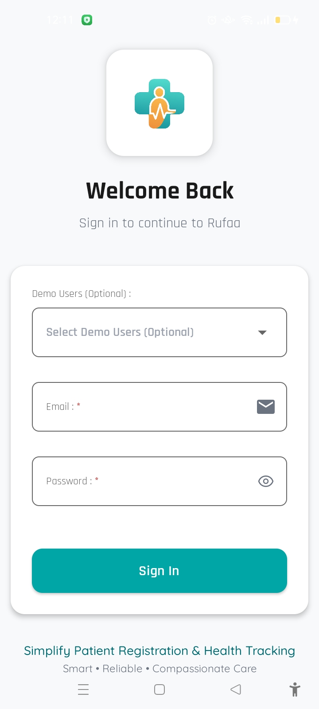
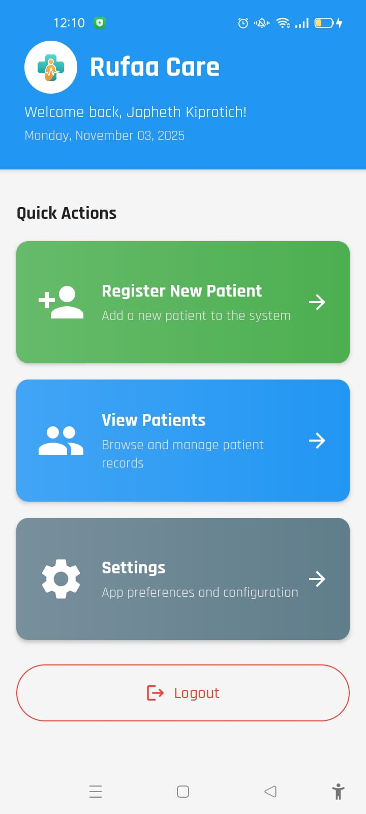
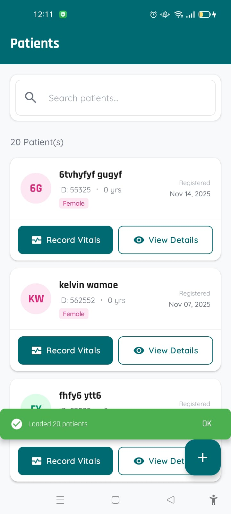
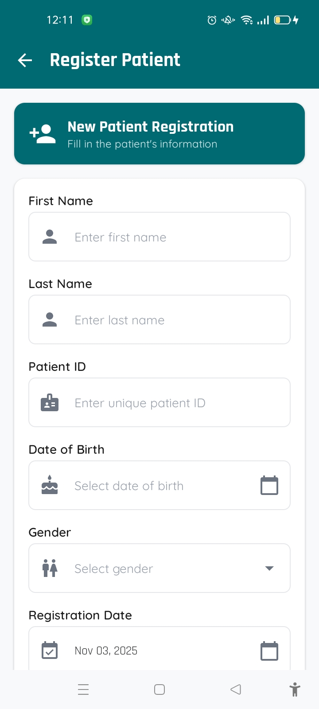
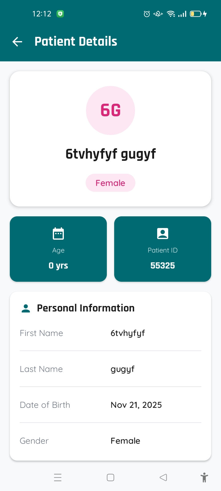

# Rufaa Care

<div align="center">
  
  
  [](https://opensource.org/licenses/MIT)
  [](https://www.android.com/)
  [](http://kotlinlang.org)

  A comprehensive patient management system for healthcare providers to register patients and track vital signs including height, weight, and BMI calculations.
</div>

## 📱 Screenshots

<div style="display: flex; flex-wrap: wrap; gap: 10px; justify-content: center;">
  
  
  
  
  
  
</div>

## ✨ Features

- **Patient Registration**: Quickly register new patients with essential details
- **Vital Signs Tracking**: Record and monitor key health metrics including:
  - Height and weight measurements
  - Automatic BMI calculation
  - Historical data tracking
- **Comprehensive Records**: Maintain detailed patient health records
- **Offline Capability**: Full functionality without internet connection
- **Data Security**: Secure storage of sensitive health information
- **Intuitive Interface**: Easy-to-use design for healthcare professionals

## 🛠 Technologies

- **Language**: [Kotlin](https://kotlinlang.org/)
- **Architecture**: MVVM (Model-View-ViewModel)
- **Dependency Injection**: Dagger Hilt
- **Database**: Room
- **Networking**: Retrofit
- **Asynchronous**: Kotlin Coroutines & Flow
- **UI**: Jetpack Compose (if applicable)
- **Testing**: JUnit, MockK, Espresso

## 🚀 Getting Started

### Prerequisites

- Android Studio Arctic Fox or later
- Android SDK 21 or higher
- JDK 11 or higher

### Installation

1. Clone the repository:
   ```bash
   git clone https://github.com/samAricha/Intellisoft-Rufaa.git
   cd Intellisoft-Rufaa
   ```
2. Open the project in Android Studio
3. Sync the project with Gradle files
4. Build and run the app on an emulator or physical device

## 🤝 Contributing

Contributions are what make the open-source community such an amazing place to learn, inspire, and create. Any contributions you make are **greatly appreciated**.

1. Fork the Project
2. Create your Feature Branch (`git checkout -b feature/AmazingFeature`)
3. Commit your Changes (`git commit -m 'Add some AmazingFeature'`)
4. Push to the Branch (`git push origin feature/AmazingFeature`)
5. Open a Pull Request

## 📄 License

Distributed under the MIT License. See `LICENSE` for more information.

## 📧 Contact

Aricha - [@samAricha](https://github.com/samAricha) - samaricha001@gmail.com

Project Link: [https://github.com/samAricha/Intellisoft-Rufaa](https://github.com/samAricha/Intellisoft-Rufaa)

## 🙏 Acknowledgments

- [JetBrains](https://www.jetbrains.com/)
- [Android Developers](https://developer.android.com/)
- [Kotlin](https://kotlinlang.org/)

---

<div align="center">
  Made with ❤️ by Your Team
</div>
